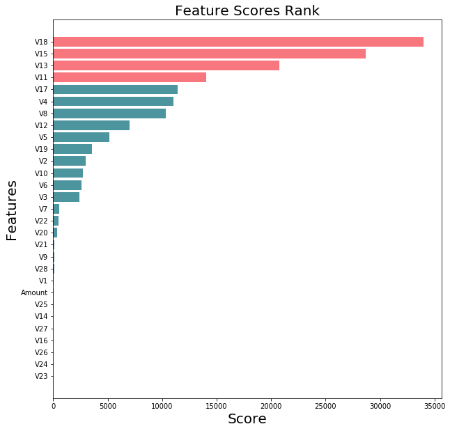
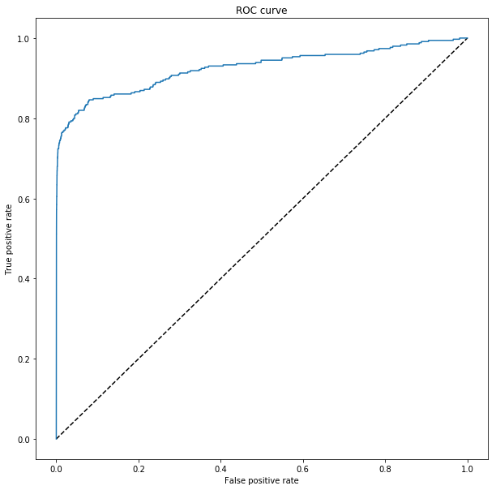
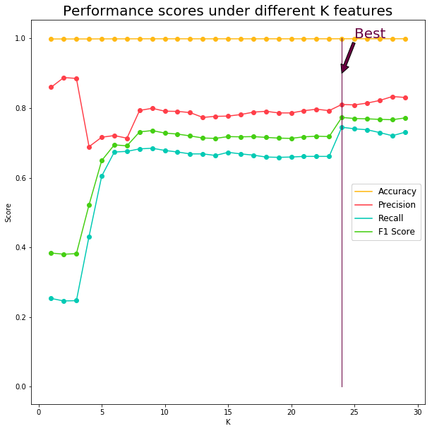
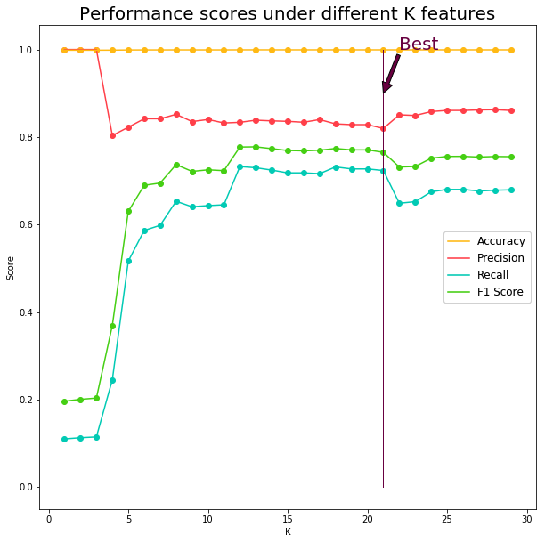
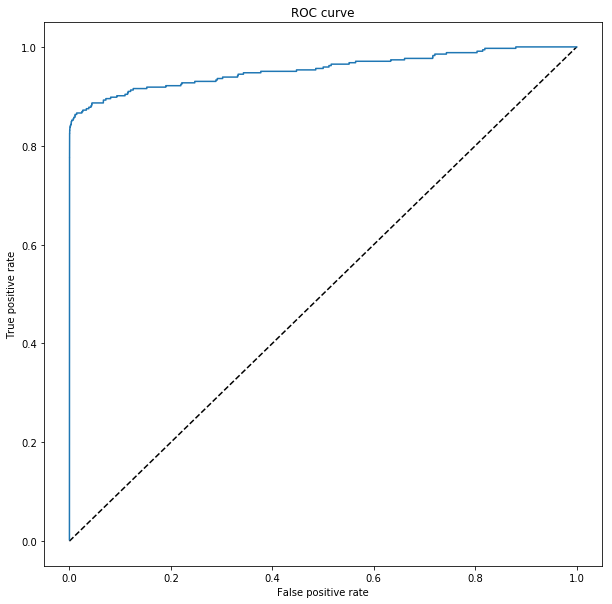
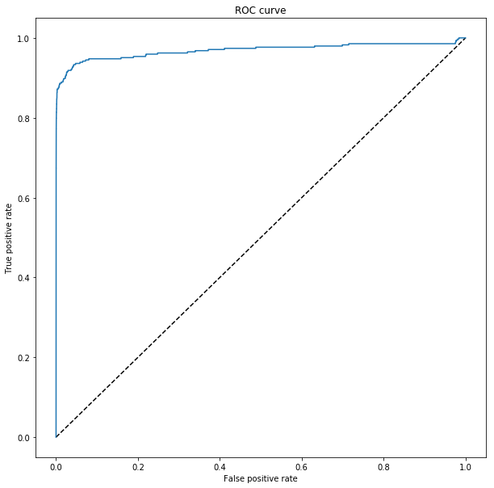
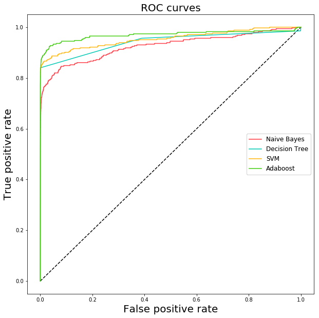

# Optimized Approach using Machine Learning on Credit Card Fraud Dataset
**Via performance metrics and paralell processing**

*Author: Jie Hu,  jie.hu.ds@gmail.com*

------------

## 0. Abstract

This is a project in which I use performance metrics to optimize machine learning algorithm to predict fraud transactions in [Kaggle Credit Card Fraud Detection](https://www.kaggle.com/dalpozz/creditcardfraud/kernels).

The goal of this research is to find out most significant features to predict whether a transaction in the dataset is committed to fraud. The structure of this article is:
- Data Wrangling, in which I modify NA values and remove outliers
- Feature Selecting, in which I create some features I think important to predict fraud
- Training and tuning machine learning, in which I use sklearn to train 4 different models and compare their performance matrices, including precision, recall and f1 score, and plot ROC curves to compare the models
- Final part, in which I select Naive Bayes as my best model
- Conclusion

## 1. Data Wrangling

Firstly, load the dataset:


```python
# Packages
import pandas as pd
import numpy as np
import matplotlib.pyplot as plt
from sklearn import preprocessing
from sklearn.feature_selection import SelectKBest
from sklearn.feature_selection import f_classif

```


```python
df = pd.read_csv("creditcard.csv")
df.shape
```


    (284807, 31)


```python
df.columns
```


    Index([u'Time', u'V1', u'V2', u'V3', u'V4', u'V5', u'V6', u'V7', u'V8', u'V9',
           u'V10', u'V11', u'V12', u'V13', u'V14', u'V15', u'V16', u'V17', u'V18',
           u'V19', u'V20', u'V21', u'V22', u'V23', u'V24', u'V25', u'V26', u'V27',
           u'V28', u'Amount', u'Class'],
          dtype='object')


```python
sum(df.Class), round(sum(df.Class)*1.0/df.shape[0],5)
```


    (492, 0.00173)


This dataset presents transactions that occurred in two days, where we have 492 frauds out of 284,807 transactions. The dataset is highly unbalanced, the positive class (frauds) account for 0.173% of all transactions.

Since the dataset is processed and now there's no NA values, so no need to clean the dataset.

On the other hand, the dataset is processed by PCA, so I would assume all outliers, if any, would not be meaningless.

## 2. Feature Selecting

Then, to begin with, I use all features and, under each algorithm I tune, use KBest to select features by their scores and compare the recall/precision rate.


```python
features_list = np.array(df.columns)[:-1]
lable_column = np.array(df.columns)[-1]

features, labels = df[features_list], df[lable_column]
```

One more step before start fitting is re-scale the data by sklearn.MinMaxScaler, because some of the algorithms I will implement might require re-scale features to avoid skewed distance and biased result.


```python
min_max_scaler = preprocessing.MinMaxScaler()
features = min_max_scaler.fit_transform(features)
```


```python


data_all = SelectKBest(f_classif, k='all').fit(features,labels)
```


```python
# fit_transform(X, y)
import operator

scores = data_all.scores_
score_dict = {}
for ii in range(len(features_list) - 1):
    score_dict[features_list[ii+1]] = round(scores[ii],2)

sorted_score_dict = sorted(score_dict.items(), key=operator.itemgetter(1), reverse=False)

```

Then I plot the features sorted by their scores:


```python
features_lst = [item[0] for item in sorted_score_dict]
y_pos = np.arange(len(features_lst))
scores = [item[1] for item in sorted_score_dict]
bar_pos_rate = 2.5 # adjust gap between bars

colors = ["#f63d47" if i >  len(scores) - 5 else "#006775" for i in range(len(scores))]
plt.figure(figsize=(10,10))
plt.barh(y_pos*bar_pos_rate, scores, 2, align='center', alpha=0.7, color = colors)
plt.yticks(y_pos*bar_pos_rate, features_lst)
plt.ylabel('Features',fontsize = 20)
plt.title('Feature Scores Rank',fontsize = 20)
plt.xlabel("Score",fontsize = 20)
plt.show()
```





```python
features_lst.reverse() # will use this later
```

From the plot, it seems 7 is a great cut-off to select features because more than 7 features will not have high score. However, here I will keep this plot as a reference, I will explore more about how the recall rate and precision rate will be changed and then compare all these plot to select best combination.

## 3. Training and Tuning Machine Learning

Before training, I will use validation to see how algorithms generalized to the overall data outside training data. Without validation, there's pretty high risk of overfitting.

After that, I run each model independently and tune for the best performance of each type of model.

### 3.1 About Tuning Models

It's very important to tune the model, not only because each model, there might be a lot of combination of parameters and hence make big influence on performance of our model, but also, we can have better chance to see how model can better match the data in an optimization process.

Without tuning the model, we might save a lot of time and get a good result, but there's always a question "can we do better" over the head. And if the model get bad prediction when there's new data coming, we even don't know where the problem is. So tune the model might cost sometime, but it did save time in future for further exploration and better improved the performance and robustness of model.


### 3.2 Naive Bayes

Similarly, I tune the model for each K from 1 to 25, and plot the performance matrices:


```python
from sklearn.model_selection import train_test_split
labels = df['Class']
features = df.drop('Class',1)
features_train, features_test, labels_train, labels_test = train_test_split(features, 
                                                                            labels, 
                                                                            random_state=1,
                                                                            stratify = labels,
                                                                            test_size=0.7)
```


```python
features_train.shape
```


    (85442, 30)


```python
sum(labels_train), round(sum(labels_train)*1.0/labels_train.shape[0],5)
```


    (148, 0.00173)


```python
from sklearn.model_selection import train_test_split
from sklearn.model_selection import GridSearchCV
from sklearn.metrics import precision_score, recall_score, accuracy_score, f1_score
import numpy as np

# classifier test function
# extract data with k best features
# use stratified sampling iteratively to get precision / recall / f1 / accuracy
# return the 4 average scores

def classifer_tester(classifier, features_lst, parameters, k, iterations=100):
    
    precision = []
    recall = []
    accuracy = []
    f1score = []
    
    ### Extract data with k best features
    
    k_best_features_list = features_lst[0:k]
    # print k_best_features_list
    ### Extract features and labels from dataset
    features = features_train[k_best_features_list]
    labels = labels_train
    
    
    ### Iteratively to get average scores
    for ii in range(iterations):
        
        
        X_train, X_test, Y_train, Y_test = train_test_split(features, 
                                                            labels, 
                                                            random_state=ii*10,
                                                            stratify = labels)
        grid_search = GridSearchCV(classifier, parameters)
        grid_search.fit(X_train, Y_train)
        predictions = grid_search.predict(X_test)
        precision.append(precision_score(Y_test, predictions))
        recall.append(recall_score(Y_test, predictions))
        accuracy.append(accuracy_score(Y_test, predictions))
        f1score.append(f1_score(Y_test, predictions))
    
    precision_mean = np.array(precision).mean()
    recall_mean = np.array(recall).mean()
    accuracy_mean = np.array(accuracy).mean()
    f1score_mean = np.array(f1score).mean()
    
    return precision_mean, recall_mean, accuracy_mean, f1score_mean

```


```python
import datetime
from multiprocessing import Pool
from sklearn.naive_bayes import GaussianNB

def GB_classifer_tester(k):
    return classifer_tester(GaussianNB(), 
                            features_lst=features_lst, 
                            parameters={}, 
                            k=k,
                            iterations = 30)
if __name__ == '__main__':
    pool = Pool()
    Ks = range(1,30)
    t1 = datetime.datetime.now()
    results = pool.map(GB_classifer_tester, Ks)
    precisions =[]
    recalls = []
    accuracies = []
    f1_scores = []
    for i in range(len(results)):
        precisions.append(results[i][0])
        recalls.append(results[i][1])
        accuracies.append(results[i][2])
        f1_scores.append(results[i][3])
    print(datetime.datetime.now() - t1)
```

    0:01:20.159037


```python
Ks = range(1,30)
plt.figure(figsize=(10,10))
plt.scatter(Ks,precisions, color = "#ff3f49")
precision_line, = plt.plot(Ks,precisions, label="Precision", color = "#ff3f49")
plt.scatter(Ks,recalls, color = "#01cab4")
recall_line, = plt.plot(Ks,recalls, label="Recall", color = "#01cab4")
plt.scatter(Ks,accuracies, color = "#ffb914")
accuracy_line, = plt.plot(Ks,accuracies, label="Accuracy", color = "#ffb914")
plt.scatter(Ks,f1_scores, color = "#45cf13")
f1score_line, = plt.plot(Ks,f1_scores, label="F1 Score", color = "#45cf13")
plt.annotate('Best', xy=(4, 0.9), xytext=(5, 1), color = "#680040", fontsize = 20,
            arrowprops=dict(facecolor='#680040', shrink=-1.35),
            )
plt.plot([4, 4], [0, 1], 'k-', lw=1, color = "#680040")
plt.title("Performance scores under different K features", fontsize = 20)
plt.xlabel("K")
plt.ylabel("Score")

# Create a legend for the first line.
legends = plt.legend(handles=[accuracy_line,
                              precision_line, 
                              recall_line,
                              f1score_line], 
                     fontsize = 12,
                     loc=5)
# Add the legend manually to the current Axes.
plt.gca().add_artist(legends)

plt.show()
```


The accuracy is an average score to show how much percentage we get the right prediction. As it's not suitable for skewed features, here I add precision and recall matrices to evaluate.


Precision is how much probability we get a sample with true if it's tested positive. By bayes prior and post probability:

$$Precision = P(T | +) = \frac{P(+|T)}{P(+|T)+P(+|F)}$$

In other words, precision is a measure of result relevancy, while recall is a measure of how many truly relevant results are returned:

$$Recall = \frac{P(+|T)}{P(+|T)+P(-|T)}$$

- Higher precission means, with transaction identified as fraud by this model, we have higher correct rate
- Higher recall means, if the transaction is fraud, then we have higher chance to identify correctly

Here we can see:

The higher recall might make precision lower, which causes a lot of non-fraud transactions to be commited fraud. So I will keep a balance here and select K = 4


Now test in test set:


```python
k_best_features_list = features_lst[0:4]
# print k_best_features_list
### Extract features and labels from dataset
features_nb_train = features_train[k_best_features_list]
labels_nb_train = labels_train
features_nb_test = features_test[k_best_features_list]
labels_nb_test = labels_test

clf = GaussianNB()

clf.fit(features_nb_train, labels_nb_train)
predictions = clf.predict(features_nb_test)

precision = precision_score(labels_nb_test, predictions)
recall = recall_score(labels_nb_test, predictions)
accuracy = accuracy_score(labels_nb_test, predictions)
f1score = f1_score(labels_nb_test, predictions)

print ('Accuracy: %s' % "{:,.2f}".format(round(accuracy, 2)) )
print ('Precision: %s' % "{:,.2f}".format(round(precision, 2)))
print ('Recall   : %s' % "{:,.2f}".format(round(recall, 2)))
print ('F1 score:  %s' % "{:,.2f}".format(round(f1score, 2)))
```

    Accuracy: 1.00
    Precision: 0.57
    Recall   : 0.58
    F1 score:  0.57


ROC Curve


```python
from sklearn import metrics
y_score = clf.fit(features_nb_train, labels_nb_train).predict_proba(features_nb_test)[:, 1]
fpr_rf_nb, tpr_rf_nb, _ = metrics.roc_curve(labels_nb_test, y_score)

```


```python
plt.figure(figsize=(10,10))
plt.plot([0, 1], [0, 1], 'k--')
plt.plot(fpr_rf_nb, tpr_rf_nb, label='RF + LR')
plt.xlabel('False positive rate')
plt.ylabel('True positive rate')
plt.title('ROC curve')
plt.show()
```





Problems of models:
Assumption of independence between transactions is not necessarily meet.

### 3.3 Decision Tree

The process is similar, but here we should set the parameters of Decision Tree and use GridSearch and visualization to get the best performance.


```python
import warnings
warnings.filterwarnings('ignore')
from multiprocessing import Pool
from sklearn import tree

# due to speed, I only check several combinations
parameters = {'criterion': ['entropy'],
               'max_depth': [3, 10],
               'min_samples_leaf': [1, 10]}

def DT_classifer_tester(k):
    return classifer_tester(tree.DecisionTreeClassifier(), 
                            features_lst=features_lst, 
                            parameters=parameters, 
                            k=k,
                            iterations = 30)
if __name__ == '__main__':
    
    t1 = datetime.datetime.now()
    pool = Pool()
    Ks = range(1,30)
    results = pool.map(DT_classifer_tester, Ks)
    precisions =[]
    recalls = []
    accuracies = []
    f1scores = []
    for i in range(len(results)):
        precisions.append(results[i][0])
        recalls.append(results[i][1])
        accuracies.append(results[i][2])
        f1scores.append(results[i][3])
    print(datetime.datetime.now() - t1)
```

    0:24:25.436445


```python
Ks = range(1,30)
plt.figure(figsize=(10,10))
plt.scatter(Ks,
            precisions, 
            color = "#ff3f49")

precision_line, = plt.plot(Ks,
                           precisions, 
                           label="Precision", 
                           color = "#ff3f49")
plt.scatter(Ks,recalls, 
            color = "#01cab4")

recall_line, = plt.plot(Ks,
                        recalls, 
                        label="Recall", 
                        color = "#01cab4")

plt.scatter(Ks,accuracies, 
            color = "#ffb914")
accuracy_line, = plt.plot(Ks,
                          accuracies, 
                          label="Accuracy", 
                          color = "#ffb914")

plt.scatter(Ks,
            f1scores, 
            color = "#45cf13")

f1score_line, = plt.plot(Ks,
                         f1scores, 
                         label="F1 Score", 
                         color = "#45cf13")

plt.annotate('Best', 
             xy=(24, 0.9), 
             xytext=(25, 1), 
             color = "#680040", 
             fontsize = 20,
             arrowprops=dict(facecolor='#680040', 
                            shrink=-1.35),
            )

plt.plot([24, 24], [0, 1], 'k-', lw=1, color = "#680040")
plt.title("Performance scores under different K features", fontsize = 20)
plt.xlabel("K")
plt.ylabel("Score")

# Create a legend for the first line.
legends = plt.legend(handles=[accuracy_line,
                              precision_line, 
                              recall_line,
                              f1score_line], 
                     fontsize = 12,
                     loc=5)
# Add the legend manually to the current Axes.
plt.gca().add_artist(legends)

plt.show()
```





From the plot we can see the model reach optimal when K = 24. 
Here I use this to train and tune the Decision Tree model again to find the best combination of parameters:


```python
from sklearn import tree
k_best_features_list = features_lst[0:24]

features_dt_train = features_train[k_best_features_list]
labels_dt_train = labels_train
features_dt_test = features_test[k_best_features_list]
labels_dt_test = labels_test

clf = tree.DecisionTreeClassifier()

# parameters to tune the best Decision Tree model
parameters = {'criterion': ['entropy'],
               'max_depth': [3, 10],
               'min_samples_leaf': [1, 10]}

grid_search = GridSearchCV(clf, parameters, n_jobs = -1)
grid_search.fit(features_dt_train, labels_dt_train)
predictions = grid_search.predict(features_dt_test)

precision = precision_score(labels_dt_test, predictions)
recall = recall_score(labels_dt_test, predictions)
accuracy = accuracy_score(labels_dt_test, predictions)
f1score = f1_score(labels_dt_test, predictions)

print ('Accuracy: %s' % "{:,.2f}".format(round(accuracy, 2)) )
print ('Precision: %s' % "{:,.2f}".format(round(precision, 2)))
print ('Recall   : %s' % "{:,.2f}".format(round(recall, 2)))
print ('F1 score:  %s' % "{:,.2f}".format(round(f1score, 2)))
```

    Accuracy: 1.00
    Precision: 0.87
    Recall   : 0.75
    F1 score:  0.81


And the best parameters are:


```python
grid_search.best_estimator_
```


    DecisionTreeClassifier(class_weight=None, criterion='entropy', max_depth=3,
                max_features=None, max_leaf_nodes=None,
                min_impurity_split=1e-07, min_samples_leaf=1,
                min_samples_split=2, min_weight_fraction_leaf=0.0,
                presort=False, random_state=None, splitter='best')


Here we care Recall and Precision the most because we want our model to increase probability to correct identify fraud with the transactions which are truely fraud and probability to get right fraud identification when we have positive test result. Thus, K = 27 will be a better choice.

And ROC curve:


```python
from sklearn import metrics
clf = tree.DecisionTreeClassifier(class_weight=None, criterion='entropy', max_depth=3,
            max_features=None, max_leaf_nodes=None,
            min_impurity_split=1e-07, min_samples_leaf=10,
            min_samples_split=2, min_weight_fraction_leaf=0.0,
            presort=False, random_state=None, splitter='best')
y_score = clf.fit(features_dt_train, labels_dt_train).predict_proba(features_dt_test)[:, 1]
fpr_rf_dt, tpr_rf_dt, _ = metrics.roc_curve(labels_dt_test, y_score)
plt.figure(figsize=(10,10))
plt.plot([0, 1], [0, 1], 'k--')
plt.plot(fpr_rf_dt, tpr_rf_dt, label='Decision Tree')
plt.xlabel('False positive rate')
plt.ylabel('True positive rate')
plt.title('ROC curve')
plt.show()
```


```python
from IPython.display import Image
Image(filename='tree.png') 
```


### 3.4 Support Vector Machine

The 3rd type of model I want to use is SVM, because we have multi-dimensional dataset and big dataset. SVM's hyper-plane have its advantages when we have enough features to train the model.


```python
warnings.filterwarnings('ignore')

from sklearn import svm
parameters = {'C': [1, 10, 100, 1000],
               'gamma': [0.001, 0.0001],
               'kernel': ['rbf']}

def svm_classifer_tester(k):
    # print(k)
    # print(datetime.datetime.now())
    return classifer_tester(svm.SVC(), 
                            features_lst=features_lst, 
                            parameters=parameters, 
                            k=k,
                            iterations = 30)

if __name__ == '__main__':
    
    t1 = datetime.datetime.now()
    pool = Pool()
    Ks = list(range(1,30))
    results = pool.map(svm_classifer_tester, Ks)
    precisions =[]
    recalls = []
    accuracies = []
    f1scores = []
    for i in range(len(results)):
        precisions.append(results[i][0])
        recalls.append(results[i][1])
        accuracies.append(results[i][2])
        f1scores.append(results[i][3])
    print("Total Time:")
    print(datetime.datetime.now() - t1)
```

    Total Time:
    1:40:01.344541


```python
Ks = range(1,30)
plt.figure(figsize=(10,10))
plt.scatter(Ks,
            precisions, 
            color = "#ff3f49")

precision_line, = plt.plot(Ks,
                           precisions, 
                           label="Precision", 
                           color = "#ff3f49")
plt.scatter(Ks,recalls, 
            color = "#01cab4")

recall_line, = plt.plot(Ks,
                        recalls, 
                        label="Recall", 
                        color = "#01cab4")

plt.scatter(Ks,accuracies, 
            color = "#ffb914")
accuracy_line, = plt.plot(Ks,
                          accuracies, 
                          label="Accuracy", 
                          color = "#ffb914")

plt.scatter(Ks,
            f1scores, 
            color = "#45cf13")

f1score_line, = plt.plot(Ks,
                         f1scores, 
                         label="F1 Score", 
                         color = "#45cf13")

plt.annotate('Best', 
             xy=(21, 0.9), 
             xytext=(22, 1), 
             color = "#680040", 
             fontsize = 20,
             arrowprops=dict(facecolor='#680040', 
                            shrink=-1.35),
            )

plt.plot([21, 21], [0, 1], 'k-', lw=1, color = "#680040")
plt.title("Performance scores under different K features", fontsize = 20)
plt.xlabel("K")
plt.ylabel("Score")

# Create a legend for the first line.
legends = plt.legend(handles=[accuracy_line,
                              precision_line, 
                              recall_line,
                              f1score_line], 
                     fontsize = 12,
                     loc=5)
# Add the legend manually to the current Axes.
plt.gca().add_artist(legends)

plt.show()
```





For SVM, we reach optimal at K = 21. Because F1 score, which is used to balance the precision and recall reaches optimal when k is 21.


```python
k_best_features_list = features_lst[0:21]

features_svm_train = features_train[k_best_features_list]
labels_svm_train = labels_train
features_svm_test = features_test[k_best_features_list]
labels_svm_test = labels_test

clf = svm.SVC()

# parameters to tune the best SVM model
parameters = {'C': [1, 10, 100, 1000],
               'gamma': [0.001, 0.0001],
               'kernel': ['rbf']}

grid_search = GridSearchCV(clf, parameters, n_jobs=-1)
grid_search.fit(features_svm_train, labels_svm_train)
predictions = grid_search.predict(features_svm_test)

precision = precision_score(labels_svm_test, predictions)
recall = recall_score(labels_svm_test, predictions)
accuracy = accuracy_score(labels_svm_test, predictions)
f1score = f1_score(labels_svm_test, predictions)

print ('Accuracy: %s' % "{:,.2f}".format(round(accuracy, 2)) )
print ('Precision: %s' % "{:,.2f}".format(round(precision, 2)))
print ('Recall   : %s' % "{:,.2f}".format(round(recall, 2)))
print ('F1 score:  %s' % "{:,.2f}".format(round(f1score, 2)))
```

    Accuracy: 1.00
    Precision: 0.89
    Recall   : 0.77
    F1 score:  0.83


The best parameters are:


```python
grid_search.best_estimator_
```


    SVC(C=100, cache_size=200, class_weight=None, coef0=0.0,
      decision_function_shape=None, degree=3, gamma=0.001, kernel='rbf',
      max_iter=-1, probability=False, random_state=None, shrinking=True,
      tol=0.001, verbose=False)


```python
# ROC Curve, probability in SVC should be set to True to enable proba method
clf = svm.SVC(C=100, gamma=0.0001, kernel='rbf', probability=True)
y_score = clf.fit(features_svm_train, labels_svm_train).predict_proba(features_svm_test)[:, 1]
fpr_rf_svm, tpr_rf_svm, _ = metrics.roc_curve(labels_svm_test, y_score)
plt.figure(figsize=(10,10))
plt.plot([0, 1], [0, 1], 'k--')
plt.plot(fpr_rf_svm, tpr_rf_svm, label='RF + LR')
plt.xlabel('False positive rate')
plt.ylabel('True positive rate')
plt.title('ROC curve')
plt.show()
```





SVM model does have the best ROC curve among the 3 types of models we tried.

### 3.5 Adaboost (Based on Decision Tree)


```python
from sklearn.ensemble import AdaBoostClassifier


def adb_classifer_tester(k):

    return classifer_tester(AdaBoostClassifier(), 
                            features_lst=features_lst, 
                            parameters={}, 
                            k=k,
                            iterations = 30)
if __name__ == '__main__':
    
    t1 = datetime.datetime.now()
    pool = Pool()
    Ks = list(range(1,30))
    results = pool.map(adb_classifer_tester, Ks)
    precisions =[]
    recalls = []
    accuracies = []
    f1scores = []
    for i in range(len(results)):
        precisions.append(results[i][0])
        recalls.append(results[i][1])
        accuracies.append(results[i][2])
        f1scores.append(results[i][3])
    print(datetime.datetime.now() - t1)
```

    1:19:50.209986


```python
Ks = range(1,30)
plt.figure(figsize=(10,10))
plt.scatter(Ks,
            precisions, 
            color = "#ff3f49")

precision_line, = plt.plot(Ks,
                           precisions, 
                           label="Precision", 
                           color = "#ff3f49")
plt.scatter(Ks,recalls, 
            color = "#01cab4")

recall_line, = plt.plot(Ks,
                        recalls, 
                        label="Recall", 
                        color = "#01cab4")

plt.scatter(Ks,accuracies, 
            color = "#ffb914")
accuracy_line, = plt.plot(Ks,
                          accuracies, 
                          label="Accuracy", 
                          color = "#ffb914")

plt.scatter(Ks,
            f1scores, 
            color = "#45cf13")

f1score_line, = plt.plot(Ks,
                         f1scores, 
                         label="F1 Score", 
                         color = "#45cf13")

plt.annotate('Best', 
             xy=(27, 0.9), 
             xytext=(28, 1), 
             color = "#680040", 
             fontsize = 20,
             arrowprops=dict(facecolor='#680040', 
                            shrink=-1.35),
            )

plt.plot([27, 27], [0, 1], 'k-', lw=1, color = "#680040")
plt.title("Performance scores under different K features", fontsize = 20)
plt.xlabel("K")
plt.ylabel("Score")

# Create a legend for the first line.
legends = plt.legend(handles=[accuracy_line,
                              precision_line, 
                              recall_line,
                              f1score_line], 
                     fontsize = 12,
                     loc=5)
# Add the legend manually to the current Axes.
plt.gca().add_artist(legends)

plt.show()
```


It seems the more features, the better adaboost will perform. Here we can see when K= 27, we reach optimal. 


```python
k_best_features_list = features_lst[0:27]

features_adb_train = features_train[k_best_features_list]
labels_adb_train = labels_train
features_adb_test = features_test[k_best_features_list]
labels_adb_test = labels_test

clf = AdaBoostClassifier()

# parameters to tune the best SVM model
parameters = {}

grid_search = GridSearchCV(clf, parameters, n_jobs=-1)
grid_search.fit(features_adb_train, labels_adb_train)
predictions = grid_search.predict(features_adb_test)

precision = precision_score(labels_adb_test, predictions)
recall = recall_score(labels_adb_test, predictions)
accuracy = accuracy_score(labels_adb_test, predictions)
f1score = f1_score(labels_adb_test, predictions)

print ('Accuracy: %s' % "{:,.2f}".format(round(accuracy, 2)) )
print ('Precision: %s' % "{:,.2f}".format(round(precision, 2)))
print ('Recall   : %s' % "{:,.2f}".format(round(recall, 2)))
print ('F1 score:  %s' % "{:,.2f}".format(round(f1score, 2)))
```

    Accuracy: 1.00
    Precision: 0.85
    Recall   : 0.71
    F1 score:  0.77


```python
grid_search.best_estimator_
```


    AdaBoostClassifier(algorithm='SAMME.R', base_estimator=None,
              learning_rate=1.0, n_estimators=50, random_state=None)


```python
# ROC Curve, probability in SVC should be set to True to enable proba method
clf = AdaBoostClassifier() # the parameters are the same as default
y_score = clf.fit(features_adb_train, labels_adb_train).predict_proba(features_adb_test)[:, 1]
fpr_rf_adb, tpr_rf_adb, _ = metrics.roc_curve(labels_adb_test, y_score)
plt.figure(figsize=(10,10))
plt.plot([0, 1], [0, 1], 'k--')
plt.plot(fpr_rf_adb, tpr_rf_adb, label='RF + LR')
plt.xlabel('False positive rate')
plt.ylabel('True positive rate')
plt.title('ROC curve')

plt.show()
```





## 4. Final Discussion

Now let's put together and select the best model and feature list.

Score Type|Naive Bayes| Decision Tree | SVM|Adaboost
------------|------------|------------|------------|------------
Num of features|4|24|23|27
Accuracy|1|1|1|1
Precision|0.57|0.86|0.89|0.85
Recall|0.58|0.76|0.77|0.71
F1 score|0.57|0.80|0.83|0.77

Recall the ROC curves:


```python
plt.figure(figsize=(10,10))
plt.plot([0, 1], [0, 1], 'k--')
nb_line, = plt.plot(fpr_rf_nb, tpr_rf_nb, label='Naive Bayes',  color = "#ff3f49")
dt_line, = plt.plot(fpr_rf_dt, tpr_rf_dt, label='Decision Tree',color = "#01cab4")
svm_line, = plt.plot(fpr_rf_svm, tpr_rf_svm, label='SVM',  color = "#ffb914")
adb_line, = plt.plot(fpr_rf_adb, tpr_rf_adb, label='Adaboost',  color = "#45cf13")
         
plt.xlabel('False positive rate', fontsize = 20)
plt.ylabel('True positive rate', fontsize = 20)
plt.title('ROC curve')
plt.title("ROC curves", fontsize = 20)
legends = plt.legend(handles=[nb_line,
                              dt_line, 
                              svm_line,
                              adb_line], 
                     fontsize = 12,
                     loc=5)
# Add the legend manually to the current Axes.
plt.gca().add_artist(legends)

plt.show()
```





I notice best model for out of sample test here is when K = 21, we use SVM with parameters:

SVC(C=100, cache_size=200, class_weight=None, coef0=0.0,
  decision_function_shape=None, degree=3, gamma=0.0001, kernel='rbf',
  max_iter=-1, probability=False, random_state=None, shrinking=True,
  tol=0.001, verbose=False)

The best performance in testing set is:

Precision: 0.841823
Recall: 0.796954
Accuracy: 0.999390
F1 Score: 0.818774


## 5. Conclusion

In this report I firstly summarize the dataset, use visualization to find out interesting correlations among fraud and other features. Then I train 3 different models, and finally find SVM as my best model and number of features K = 21.

This is a quantative analysis and can only be a reference for commitment. The real procedure of fraud commitment is quite complex.

In future, to improve the accuracy of the model, I think there're some ways we can try:
- Given more detailed dataset, more features might have risk of overfitting, but more data can possibly provide more informaiton we need
- Given more data with fraud so it will be easier to catch up with more significant predictors.


```python

```
